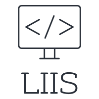

<!-- PROJECT SHIELDS -->
<!--
*** I'm using markdown "reference style" links for readability.
*** Reference links are enclosed in brackets [ ] instead of parentheses ( ).
*** See the bottom of this document for the declaration of the reference variables
*** for contributors-url, forks-url, etc. This is an optional, concise syntax you may use.
*** https://www.markdownguide.org/basic-syntax/#reference-style-links
-->
[![MIT License][license-shield]][license-url]
[![LinkedIn][linkedin-shield]][linkedin-url]


<!-- PROJECT LOGO -->
<br />
<p align="center">
  <a href="https://github.com/futurenowait/level2Scraper">
    
  </a>

  <h3 align="center">Level II Scraper</h3>

  <p align="center">
    Software written in Python to collect and process level II data from Crypto Exchanges
    
  </p>
</p>


<!-- TABLE OF CONTENTS -->
## Table of Contents

* [About the Project](#about-the-project)
* [Getting Started](#getting-started)
  * [Prerequisites](#prerequisites)
  * [Installation](#installation)
* [Usage](#usage)
* [Roadmap](#roadmap)
* [License](#license)
* [Contact](#contact)
* [Acknowledgements](#acknowledgements)


<!-- ABOUT THE PROJECT -->
## About The Project

Project started as simple websocket client for gathering market data. 
Main purpose of this tool:
* Handle connection to crypto exchanges
* Process incoming data to simple csv format

Of course, it's not perfect and needs more development, but at this time it serves it's purpose

<!-- GETTING STARTED -->
## Getting Started

To get a local copy up and running follow these simple steps.

### Prerequisites

Things we will need for successful build:
* python >= 3.6
* pip
```sh
sudo apt update
sudo apt install python3 python3-pip
```

Everything else will be handled by setuputils manager.

### Installation
 
1. Clone the repo
```sh
git clone https://github.com/futurenowait/level2Scraper.git
```
:warning: **If you need other than default symbols**: Edit config.ini before running 3rd step!

2. Edit ```level2scraper/config.ini```
```sh

[STREAM.BITMEX]

    ### Websocket url, no need to change this
    url = wss://www.bitmex.com/realtime

    ### XBTUSD, ETHUSD, XRPUSD, ADAU20, BCHUSD, EOSU20, LTCU20, TRXU20 - Available symbols to choose from
    ### Simple separate symbols with ,
    symbols = XBTUSD,ETHUSD

    
    ### How many times socket will try to reconnect to server before throwing error
    max_retry_connections = 10

```
3. Install required packages
```sh
sudo python3 setup.py install
```


<!-- USAGE EXAMPLES -->
## Usage

Use this space to show useful examples of how a project can be used. Additional screenshots, code examples and demos work well in this space. You may also link to more resources.

_For more examples, please refer to the [Documentation](https://example.com)_


<!-- ROADMAP -->
## Roadmap


<!-- CONTRIBUTING -->
## Contributing

Any contributions you make are **greatly appreciated**.

1. Fork the Project
2. Create your Feature Branch (`git checkout -b feature/AmazingFeature`)
3. Commit your Changes (`git commit -m 'Add some AmazingFeature'`)
4. Push to the Branch (`git push origin feature/AmazingFeature`)
5. Open a Pull Request


<!-- LICENSE -->
## License

Distributed under the MIT License. See `LICENSE` for more information.


<!-- CONTACT -->
## Contact

Lukas - lkspetravicius@gmail.com

Project Link: [https://github.com/futurenowait/level2Scraper](https://github.com/futurenowait/level2Scraper)


<!-- ACKNOWLEDGEMENTS -->
## Acknowledgements
* [Websockets](https://github.com/aaugustin/websockets)
* [PyZMQ](https://github.com/zeromq/pyzmq)
* [Best README Template](https://github.com/othneildrew/Best-README-Template)


<!-- MARKDOWN LINKS & IMAGES -->
<!-- https://www.markdownguide.org/basic-syntax/#reference-style-links -->
[license-shield]: https://img.shields.io/github/license/othneildrew/Best-README-Template.svg?style=flat-square
[license-url]: https://github.com/futurenowait/level2Scraper/blob/master/LICENSE.txt
[linkedin-shield]: https://img.shields.io/badge/-LinkedIn-black.svg?style=flat-square&logo=linkedin&colorB=555
[linkedin-url]: https://www.linkedin.com/in/lukas-petravicius/
[product-screenshot]: images/screenshot.png
